# Dynamic Table Generation: Harnessing the Diffusion Model

## Running Sequence

1. **Prepare Dataset Labels**  
   Run the following script to prepare dataset labels:
python Dynamic_Table_Generation/utils/dataset_label_preparation.py
*Ensure the dataset is located at the path:* `./Dataset/PubTabNet/pubtabnet/pubtabnet`.

2. **Train the Model**  
To train the model, execute:
python Dynamic_Table_Generation/main.py

3. **Generate SSIM Score**  
To calculate the SSIM score for model evaluation, run:
python SSIM_Score/main.py

4. **Generate Table as Web Service**  
To generate tables as a web service, run:
python Table_Generation/app.py

Open the webpage and provide the necessary input to get generated tables.

---

### Label Preperation sample, training and validation loss curves

**Label Preparation**

  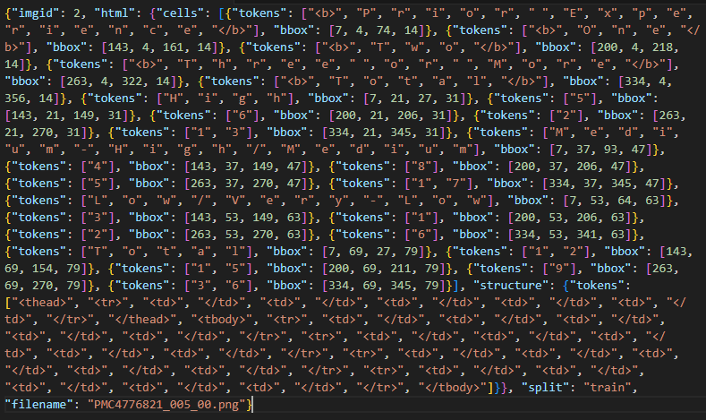
   
  <em>Labels before processing</em>

  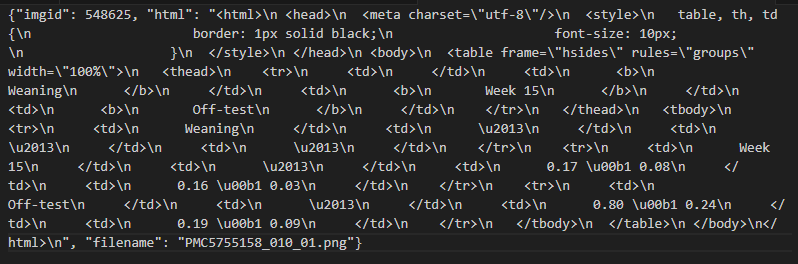
   
  <em>Labels after processing</em>

**Training and Validation Loss**

  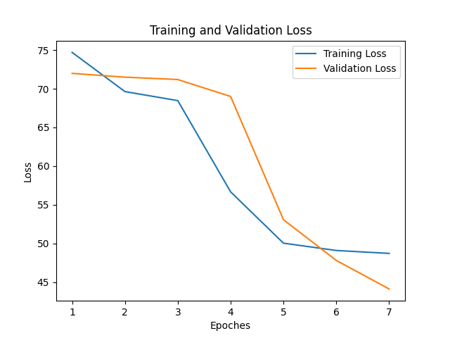
   
  <em>Loss Curve for Timesteps - 10</em>

  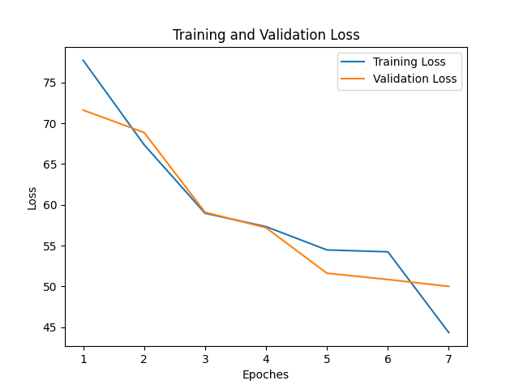
   
  <em>Loss Curve for Timesteps - 15</em>

  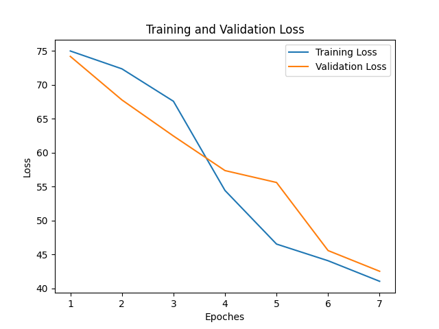
   
  <em>Loss Curve for Timesteps - 20</em>

  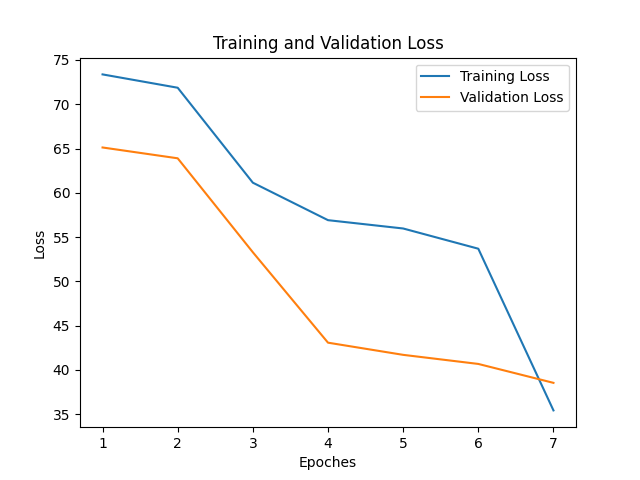
   
  <em>Loss Curve for Timesteps - 30</em>

  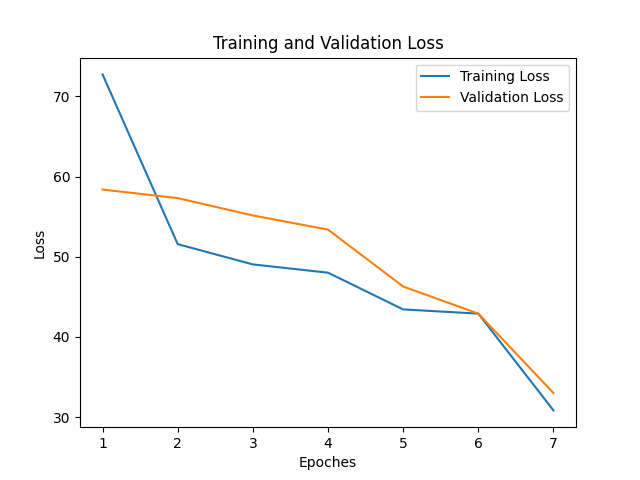
   
  <em>Loss Curve for Timesteps - 40</em>

  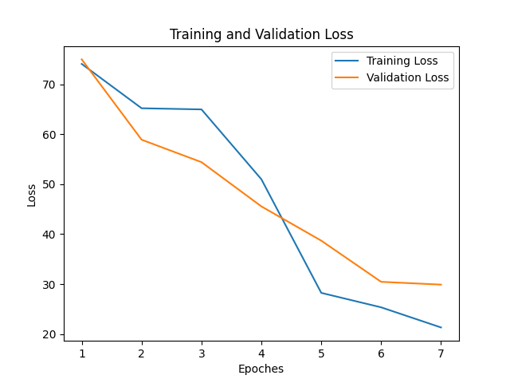
   
  <em>Loss Curve for Timesteps - 50</em>

### Sample Output

Below are samples of generated images via the web service:

**Generated images through web service**

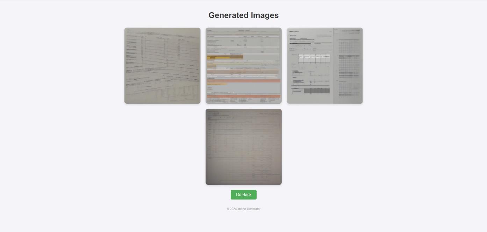
 
<em>Generated Images for Timesteps - 10</em>

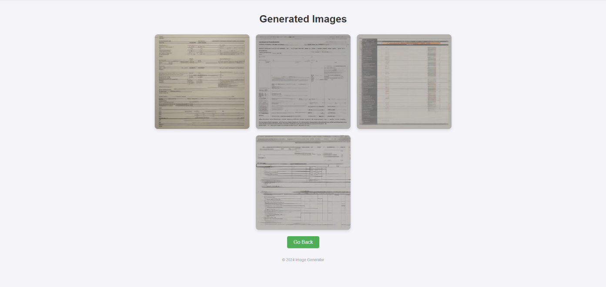
 
<em>Generated Images for Timesteps - 15</em>

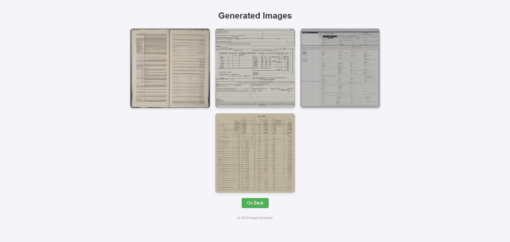
 
<em>Generated Images for Timesteps - 20</em>

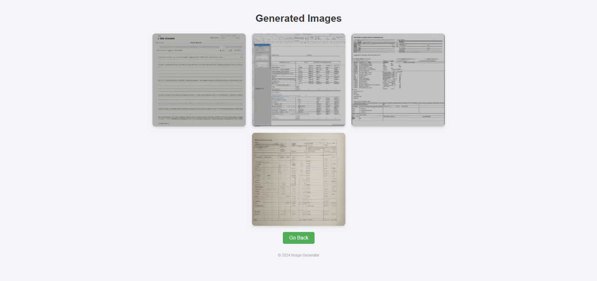
 
<em>Generated Images for Timesteps - 30</em>

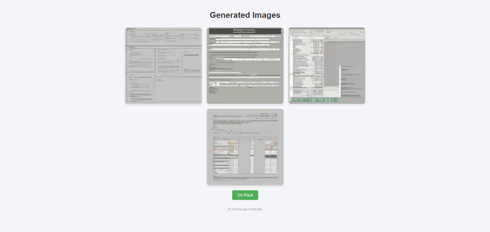
 
<em>Generated Images for Timesteps - 40</em>

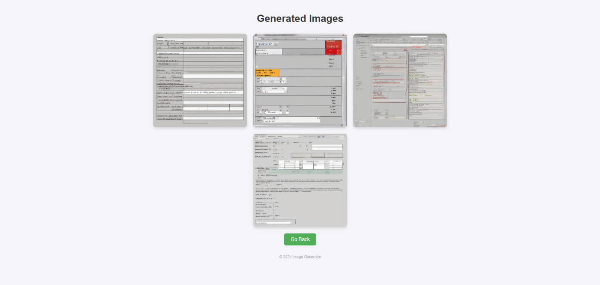
 
<em>Generated Images for Timesteps - 50</em>

